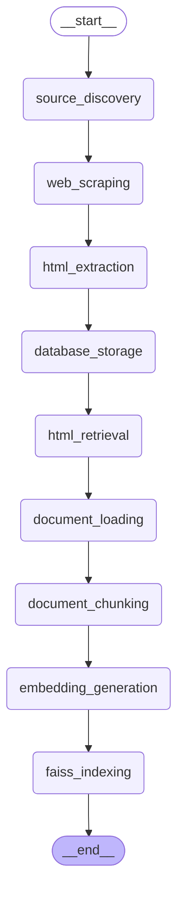

# Advanced Government Information RAG System Architecture (LangGraph)

## 1. Upgraded Database-First Query-Time Retrieval & Ingestion Workflow

```mermaid
---
config:
  flowchart:
    curve: linear
---
graph TD;
	__start__([<p>__start__</p>]):::first
	language_detection(language_detection)
	query_normalization(query_normalization)
	multilingual_query_expansion(multilingual_query_expansion)
	query_translation(query_translation)
	query_analysis(query_analysis)
	query_decomposition(query_decomposition)
	query_rewriting(query_rewriting)
	document_availability_check(document_availability_check)
	web_search(web_search)
	url_validation(url_validation)
	web_scraping(web_scraping)
	html_extraction(html_extraction)
	database_storage(database_storage)
	html_retrieval(html_retrieval)
	document_loading(document_loading)
	document_chunking(document_chunking)
	embedding_generation(embedding_generation)
	faiss_indexing(faiss_indexing)
	hybrid_retrieval_entry(hybrid_retrieval_entry)
	vector_retrieval(vector_retrieval)
	bm25_retrieval(bm25_retrieval)
	reciprocal_rank_fusion(reciprocal_rank_fusion)
	reranking(reranking)
	retrieval_evaluation(retrieval_evaluation)
	source_verification(source_verification)
	contextual_compression(contextual_compression)
	document_language_detection(document_language_detection)
	context_understanding(context_understanding)
	answerability_evaluation(answerability_evaluation)
	knowledge_refinement(knowledge_refinement)
	answer_generation(answer_generation)
	faithfulness_evaluation(faithfulness_evaluation)
	citation_validation(citation_validation)
	controlled_fallback(controlled_fallback)
	final_response(final_response)
	__end__([<p>__end__</p>]):::last
	__start__ --> language_detection;
	answer_generation --> faithfulness_evaluation;
	answerability_evaluation -.-> answer_generation;
	answerability_evaluation -.-> controlled_fallback;
	answerability_evaluation -.-> knowledge_refinement;
	bm25_retrieval --> reciprocal_rank_fusion;
	citation_validation --> final_response;
	context_understanding --> answerability_evaluation;
	contextual_compression --> document_language_detection;
	controlled_fallback --> final_response;
	database_storage --> document_loading;
	document_availability_check -.-> html_retrieval;
	document_availability_check -.-> hybrid_retrieval_entry;
	document_availability_check -.-> web_search;
	document_chunking --> embedding_generation;
	document_language_detection --> context_understanding;
	document_loading --> document_chunking;
	embedding_generation --> faiss_indexing;
	faiss_indexing --> hybrid_retrieval_entry;
	faithfulness_evaluation -.-> answer_generation;
	faithfulness_evaluation -.-> citation_validation;
	faithfulness_evaluation -.-> controlled_fallback;
	html_extraction --> database_storage;
	html_retrieval --> document_loading;
	hybrid_retrieval_entry --> bm25_retrieval;
	hybrid_retrieval_entry --> vector_retrieval;
	knowledge_refinement -.-> controlled_fallback;
	knowledge_refinement -.-> query_rewriting;
	language_detection --> query_normalization;
	multilingual_query_expansion --> query_translation;
	query_analysis --> query_decomposition;
	query_decomposition --> query_rewriting;
	query_normalization --> multilingual_query_expansion;
	query_rewriting --> document_availability_check;
	query_translation --> query_analysis;
	reciprocal_rank_fusion --> reranking;
	reranking --> retrieval_evaluation;
	retrieval_evaluation -.-> knowledge_refinement;
	retrieval_evaluation -.-> source_verification;
	source_verification --> contextual_compression;
	url_validation --> web_scraping;
	vector_retrieval --> reciprocal_rank_fusion;
	web_scraping --> html_extraction;
	web_search --> url_validation;
	final_response --> __end__;
	classDef default fill:#f2f0ff,line-height:1.2
	classDef first fill-opacity:0
	classDef last fill:#bfb6fc

```

## 2. Reusable Document Ingestion Workflow

```mermaid
---
config:
  flowchart:
    curve: linear
---
graph TD;
	__start__([<p>__start__</p>]):::first
	source_discovery(source_discovery)
	web_scraping(web_scraping)
	html_extraction(html_extraction)
	database_storage(database_storage)
	html_retrieval(html_retrieval)
	document_loading(document_loading)
	document_chunking(document_chunking)
	embedding_generation(embedding_generation)
	faiss_indexing(faiss_indexing)
	__end__([<p>__end__</p>]):::last
	__start__ --> source_discovery;
	database_storage --> html_retrieval;
	document_chunking --> embedding_generation;
	document_loading --> document_chunking;
	embedding_generation --> faiss_indexing;
	html_extraction --> database_storage;
	html_retrieval --> document_loading;
	source_discovery --> web_scraping;
	web_scraping --> html_extraction;
	faiss_indexing --> __end__;
	classDef default fill:#f2f0ff,line-height:1.2
	classDef first fill-opacity:0
	classDef last fill:#bfb6fc

```
